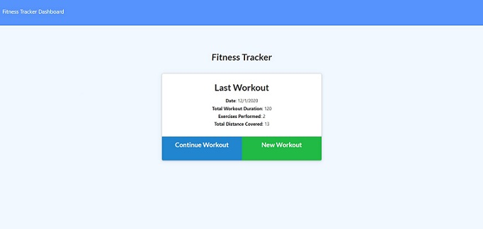

# workoutTracker

<h1 align=center>Workout Tracker</h1>

- Link to GitHub repository: https://github.com/Tzcodes101/workoutTracker

## Description
This application allows a user to reach their fitness goals more quickly by tracking their workouts. A user can view, create, and log multiple exercises on a given day. The user can input the type, weight, name, sets, reps, duration, and distance (for cardio) of an exercise.

## Table of Contents
- [Description](#Description)
- [Usage](#Usage)
- [Languages](#Languages)
- [License](#License)
- [Contributors](#Contributors)
- [Testing](#Testing)
- [Questions](#Questions)

## Usage
A user can access this project from this link: https://tz-workout-tracker.herokuapp.com/

## Languages
The languages and frameworks used in this project include:
- Javascript
- Node.js
- Mongoose
- Heroku
- Mongo Atlas

## License

This project is covered by the ISC license.

## Contributors
- Talia Zisman

## Testing
This project can be tested by following the usage instructions.

## Questions
Please e-mail the creator, Talia Zisman, of this Burger App with any questions.
- E-mail: tzcodes101@gmail.com
- GitHub: [tzcodes101](http://github.com/tzcodes101)